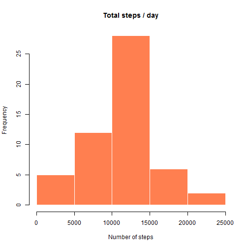
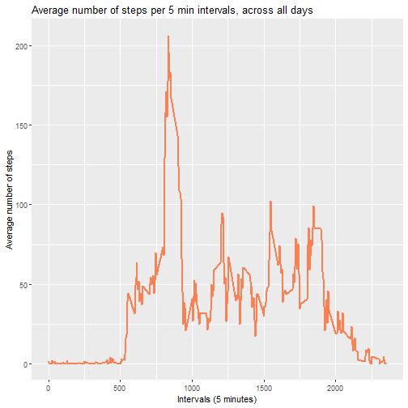
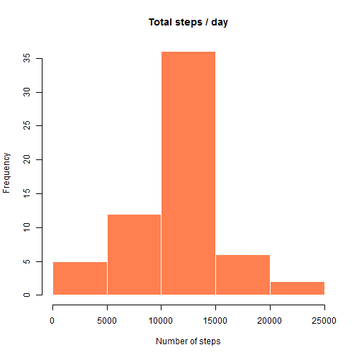
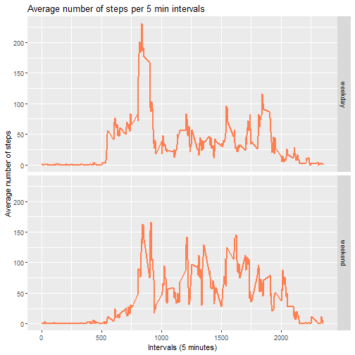

# Reproducible data: Week 1 Assignment

## Introduction
This assignment makes use of data from a personal activity monitoring device. This device collects data at 5 minute intervals through out the 
day. The data consists of two months of data from an anonymous individual collected during the months of October and November, 2012 and include 
the number of steps taken in 5 minute intervals each day.

## Loading the data
First, we need to include 2 very useful libraries.


```r
library(dplyr)
library(ggplot2)
```

Then, we need to download the zip file, and unzip it, then load the data.
If we already have the file unzipped, then just load the data into R directly.


```r
fileURL <- "https://d396qusza40orc.cloudfront.net/repdata%2Fdata%2Factivity.zip"
fileNameZip <- "activitydata.zip"
fileName <- "activity.csv"

## If zip file doesn't exist, download it
if(!file.exists(fileName))
{
	download.file(fileURL, fileNameZip)
	unzippedData <- unzip(fileNameZip)
} else {
	unzippedData <- fileName
}

data <- read.csv(unzippedData)
```

Now, let's check the data types of the data.

```r
str(data)
```

```
## 'data.frame':	17568 obs. of  3 variables:
##  $ steps   : int  NA NA NA NA NA NA NA NA NA NA ...
##  $ date    : Factor w/ 61 levels "2012-10-01","2012-10-02",..: 1 1 1 1 1 1 1 1 1 1 ...
##  $ interval: int  0 5 10 15 20 25 30 35 40 45 ...
```

We notice that the Date, is not in a date format, but a factor.
Let's convert it to a date data type.


```r
data$date <- as.Date(as.character(data$date))
```

## What is mean total number of steps taken per day?
_**1.Calculate the total number of steps taken per day**_  
Using the dplyr package, we use the pipe operator and calculate the sum of steps, grouped by day.

```r
stepsDay <- data %>% group_by(date) %>% summarise(Total_steps = sum(steps))
```

_**2.Make a histogram of the total number of steps taken each day**_  
Now, we plot the histogram to show the number of steps per day.

```r
hist(stepsDay$Total_steps, main = "Total steps / day", xlab = "Number of steps", col = "coral", border = "white")
```



_**3.Calculate and report the mean and median of the total number of steps taken per day**_  
Then, we now find the mean of the total steps taken per day, as well as the median value. Using the summary() function is perfect for that.

```r
summary(stepsDay$Total_steps)
```

```
##    Min. 1st Qu.  Median    Mean 3rd Qu.    Max.    NA's 
##      41    8841   10765   10766   13294   21194       8
```
We find that the mean and the median are pretty much the same.


## What is the average daily activity pattern?
_**1.Make a time series plot (i.e. \color{red}{\verb|type = "l"|}type="l") of the 5-minute interval (x-axis) and the average number of steps taken, averaged across all days (y-axis)**_  
We must calculate the average of steps taken, per 5 minutes interval, but the average this time is done upon all days, for a specific interval. We also have to omit the NAs values.

```r
stepsAvg <- data %>% na.omit() %>% group_by(interval) %>% summarise(Average_steps = mean(steps))
```

Then, we can plot the graph in a time series plot, using ggplot.

```r
ggplot(stepsAvg, aes(x = interval, y = Average_steps)) + geom_line(color="coral", size = 1) + xlab("Intervals (5 minutes)") + ylab("Average number of steps") + ggtitle("Average number of steps per 5 min intervals, across all days")
```



_**2.Which 5-minute interval, on average across all the days in the dataset, contains the maximum number of steps?**_  
Upon checking the time series plot above, we can easily see that the max value just rises over 200, and the interval seems to be around the 900's, based on a quick glance.
We can use the max function to determine what's the exact interval:

```r
stepsAvg %>% select(interval, Average_steps) %>% filter(Average_steps == max(Average_steps)) %>% select(interval)
```

```
## # A tibble: 1 x 1
##   interval
##      <int>
## 1      835
```
This reveals that it's at the interval of **835** that we have the highest average in number of steps.

## Imputing missing values
_**1.Calculate and report the total number of missing values in the dataset (i.e. the total number of rows with NAs)**_  
We can either use summary(), or the function below:

```r
sum(is.na(data))
```

```
## [1] 2304
```
This gives us **2304** missing values in total.

_**2.Devise a strategy for filling in all of the missing values in the dataset. The strategy does not need to be sophisticated. For example, you could use the mean/median for that day, or the mean for that 5-minute interval, etc.**_  
For that, we will do a basic *for* loop and detect that if a value is missing, we use the mean of that interval (calculated previously above, in StepsAvg) across all days.  
Note that if a value is 0, we do not consider it as missing, and thus no replacement will be made.

_**3.Create a new dataset that is equal to the original dataset but with the missing data filled in.**_  
We will store the new dataset in data2.

```r
data2 <- data
for(i in 1:nrow(data)){
	if(is.na(data[i,1])){
		intervalMeasure <- data[i, "interval"]
		data2[i,1] <- stepsAvg[stepsAvg$interval==intervalMeasure, "Average_steps"]
	}
}
```

_**4.Make a histogram of the total number of steps taken each day and Calculate and report the mean and median total number of steps taken per day. Do these values differ from the estimates from the first part of the assignment? What is the impact of imputing missing data on the estimates of the total daily number of steps?**_  
First, let's make a new histogram based on the new data frame with all missing values replaced.  
We calculate the number of steps per day, then we draw the plot.

```r
stepsDay2 <- data2 %>% group_by(date) %>% summarise(Total_steps = sum(steps))
hist(stepsDay2$Total_steps, main = "Total steps / day", xlab = "Number of steps", col = "coral", border = "white")
```



We see a difference between this new histogram, compared to the initial one, that had missing values. The differences are not too big however, we're only noticing that there's more
frequency about a higher number of steps (as seen in the middle bar reaching higher).  
Now, onto calculating the mean and median of the total number of steps, daily.

```r
summary(stepsDay2$Total_steps)
```

```
##    Min. 1st Qu.  Median    Mean 3rd Qu.    Max. 
##      41    9819   10766   10766   12811   21194
```
The median now is **15876**, vs **10765** in the initial histogram.
The mean is **15876**, about a third higher than the original mean of **10766**.

##Are there differences in activity patterns between weekdays and weekends?
_**1.Create a new factor variable in the dataset with two levels – “weekday” and “weekend” indicating whether a given date is a weekday or weekend day.**_  
If it's a weekend, we'll put it as 1. If a weekday, we'll put it as 0.  
We'll use the mutate function from dplyr, then convert the numerical type values to factors.
We'll also use another copy of a new data frame, called data3.

```r
data3 <- data2
data3 <- mutate(data3, day = case_when( (weekdays(data3$date) == 'Saturday' | weekdays(data3$date) == 'Sunday') ~ "weekend", TRUE ~ "weekday"))
data3$day <- as.factor(data3$day)
str(data3)
```

```
## 'data.frame':	17568 obs. of  4 variables:
##  $ steps   : num  1.717 0.3396 0.1321 0.1509 0.0755 ...
##  $ date    : Date, format: "2012-10-01" "2012-10-01" ...
##  $ interval: int  0 5 10 15 20 25 30 35 40 45 ...
##  $ day     : Factor w/ 2 levels "weekday","weekend": 1 1 1 1 1 1 1 1 1 1 ...
```
_**2.Make a panel plot containing a time series plot (i.e. type="l") of the 5-minute interval (x-axis) and the average number of steps taken, averaged across all weekday days or weekend days (y-axis). See the README file in the GitHub repository to see an example of what this plot should look like using simulated data. **_  
Let's calculate the mean of the number of steps per interval, but grouped by day type (based on the factor we added).

```r
stepsAvgDay <- data3 %>% group_by(interval, day) %>% summarise(Average_steps = mean(steps))
head(stepsAvgDay, 10)
```

```
## # A tibble: 10 x 3
## # Groups:   interval [5]
##    interval day     Average_steps
##       <int> <fct>           <dbl>
##  1        0 weekday       2.25   
##  2        0 weekend       0.215  
##  3        5 weekday       0.445  
##  4        5 weekend       0.0425 
##  5       10 weekday       0.173  
##  6       10 weekend       0.0165 
##  7       15 weekday       0.198  
##  8       15 weekend       0.0189 
##  9       20 weekday       0.0990 
## 10       20 weekend       0.00943
```
Now that we have the data, let's make the plot using ggplot.

```r
ggplot(stepsAvgDay, aes(x = interval, y = Average_steps)) + geom_line(color="coral", size = 1) + xlab("Intervals (5 minutes)") + ylab("Average number of steps") + ggtitle("Average number of steps per 5 min intervals") + facet_grid(day ~ .)
```


